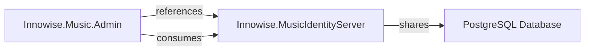
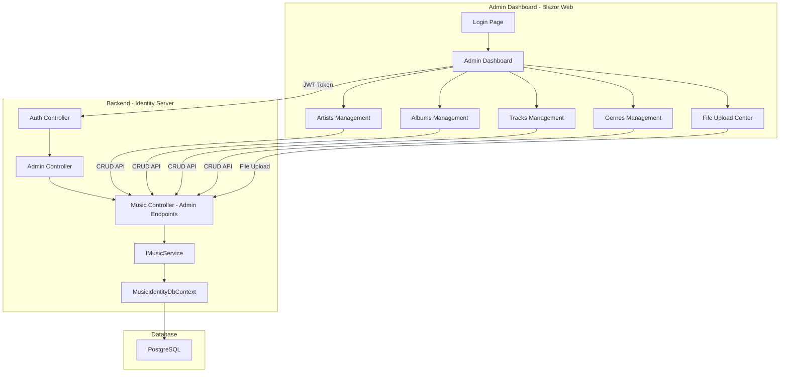
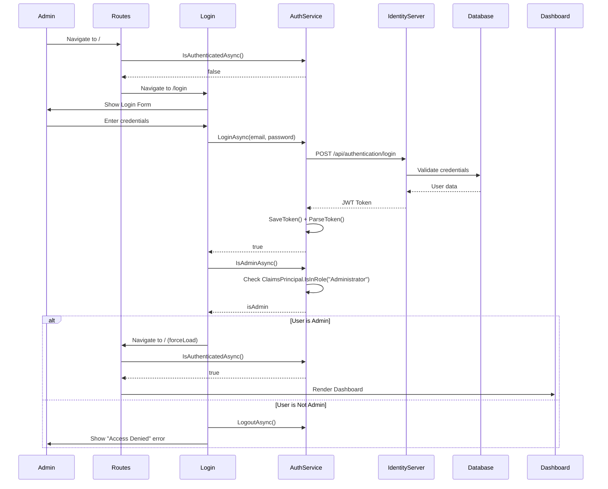

# Admin Dashboard Architecture - Innowise.Music

## Overview

The Admin Dashboard is a Blazor Web application built with .NET 9 that provides content management capabilities for the Innowise.Music streaming platform. It allows administrators to manage the music catalog including artists, albums, tracks, and genres through a web-based interface.

## Solution Integration

The Admin Dashboard will be added as a new project to the existing solution:

```
Innowise.Music.sln
├── Innowise.Music              (MAUI Client - existing)
├── Innowise.MusicIdentityServer (Backend API - existing)
├── Innowise.Music.Admin        (Blazor Web Admin - NEW)
└── docker-compose.dcproj       (Docker orchestration - existing)
```

### Solution File Updates

The `.sln` file will be updated to include the new Admin project:

```
Project("{FAE04EC0-301F-11D3-BF4B-00C04F79EFBC}") = "Innowise.Music.Admin", "Innowise.Music.Admin\Innowise.Music.Admin.csproj", "{NEW-GUID-HERE}"
EndProject
```

### Project Dependencies



The Admin project will:
- Reference the Identity Server project for shared models and DTOs
- Consume the Identity Server APIs via HTTP client
- Share the same database context for direct data access if needed

## Technology Stack

- **Framework**: .NET 9 Blazor Web App
- **UI Framework**: Blazor Server with Razor Components
- **Authentication**: JWT-based using existing Identity Server
- **Authorization**: Role-based (Admin role required)
- **File Upload**: Streaming upload for audio files
- **Database**: PostgreSQL (shared with Identity Server)

## Architecture Diagram



## Authentication & Authorization Flow

### Workflow Overview

When starting the Admin Dashboard, the following workflow is enforced:

1. **Initial Load**: User navigates to the admin dashboard URL
2. **Authentication Check**: [`Routes.razor`](../Innowise.Music.Admin/Components/Routes.razor:1) checks if user is authenticated via [`IAuthService.IsAuthenticatedAsync()`](../Innowise.Music.Admin/Services/IAuthService.cs:7)
3. **Redirect to Login**: If not authenticated, user is redirected to `/login` page
4. **Login Process**: User enters credentials on [`Login.razor`](../Innowise.Music.Admin/Components/Pages/Login.razor:1)
5. **Admin Verification**: After successful login, [`IsAdminAsync()`](../Innowise.Music.Admin/Services/IAuthService.cs:8) checks if user has "Administrator" role
6. **Dashboard Access**: Only admin users are navigated to the dashboard (`/` or `/dashboard`)
7. **Access Denied**: Non-admin users see an error message and remain on login page



### Key Components

| Component | File | Purpose |
|-----------|------|---------|
| Routes | [`Routes.razor`](../Innowise.Music.Admin/Components/Routes.razor:1) | Initial auth check, redirects to login if not authenticated |
| Login Page | [`Login.razor`](../Innowise.Music.Admin/Components/Pages/Login.razor:1) | Handles credential input and login logic |
| Auth Service | [`AuthService.cs`](../Innowise.Music.Admin/Services/AuthService.cs:10) | Manages JWT token, authentication state, and admin role check |
| Authorize View | [`AuthorizeView.razor`](../Innowise.Music.Admin/Components/Shared/AuthorizeView.razor:1) | Protects dashboard pages, shows access denied for non-admins |
| Dashboard | [`Dashboard.razor`](../Innowise.Music.Admin/Components/Pages/Dashboard.razor:1) | Main admin page, wrapped in AuthorizeView |

## Project Structure

```
Innowise.Music.Admin/
├── Components/
│   ├── Layout/
│   │   ├── MainLayout.razor
│   │   ├── NavMenu.razor
│   │   └── LoginLayout.razor
│   ├── Pages/
│   │   ├── Login.razor
│   │   ├── Dashboard.razor
│   │   ├── Artists/
│   │   │   ├── ArtistsList.razor
│   │   │   └── ArtistForm.razor
│   │   ├── Albums/
│   │   │   ├── AlbumsList.razor
│   │   │   └── AlbumForm.razor
│   │   ├── Tracks/
│   │   │   ├── TracksList.razor
│   │   │   ├── TrackForm.razor
│   │   │   └── TrackUpload.razor
│   │   └── Genres/
│   │       ├── GenresList.razor
│   │       └── GenreForm.razor
│   └── Shared/
│       ├── ConfirmDialog.razor
│       ├── FileUpload.razor
│       └── LoadingSpinner.razor
├── Services/
│   ├── AuthService.cs
│   ├── IAdminMusicService.cs
│   ├── AdminMusicService.cs
│   └── FileUploadService.cs
├── Models/
│   ├── AdminArtistDto.cs
│   ├── AdminAlbumDto.cs
│   ├── AdminTrackDto.cs
│   ├── AdminGenreDto.cs
│   └── UploadTrackRequest.cs
├── wwwroot/
│   ├── css/
│   │   └── admin-styles.css
│   └── images/
├── Program.cs
└── Innowise.Music.Admin.csproj
```

## Backend API Endpoints (Admin)

All admin endpoints require JWT authentication and Admin role.

### Artists Management

| Method | Endpoint | Description |
|--------|----------|-------------|
| GET | `/api/admin/artists` | Get all artists with pagination |
| GET | `/api/admin/artists/{id}` | Get artist by ID |
| POST | `/api/admin/artists` | Create new artist |
| PUT | `/api/admin/artists/{id}` | Update artist |
| DELETE | `/api/admin/artists/{id}` | Delete artist |

### Albums Management

| Method | Endpoint | Description |
|--------|----------|-------------|
| GET | `/api/admin/albums` | Get all albums with pagination |
| GET | `/api/admin/albums/{id}` | Get album by ID |
| POST | `/api/admin/albums` | Create new album |
| PUT | `/api/admin/albums/{id}` | Update album |
| DELETE | `/api/admin/albums/{id}` | Delete album |

### Tracks Management

| Method | Endpoint | Description |
|--------|----------|-------------|
| GET | `/api/admin/tracks` | Get all tracks with pagination |
| GET | `/api/admin/tracks/{id}` | Get track by ID |
| POST | `/api/admin/tracks` | Create new track (metadata only) |
| PUT | `/api/admin/tracks/{id}` | Update track |
| DELETE | `/api/admin/tracks/{id}` | Delete track |
| POST | `/api/admin/tracks/{id}/upload-audio` | Upload audio file for track |

### Genres Management

| Method | Endpoint | Description |
|--------|----------|-------------|
| GET | `/api/admin/genres` | Get all genres |
| GET | `/api/admin/genres/{id}` | Get genre by ID |
| POST | `/api/admin/genres` | Create new genre |
| PUT | `/api/admin/genres/{id}` | Update genre |
| DELETE | `/api/admin/genres/{id}` | Delete genre |

## Database Considerations

### Audio File Storage

Audio files will continue to be stored as BYTEA in PostgreSQL. For production, consider migrating to Azure Blob Storage or AWS S3 with CDN.

### Admin User Management

Admin users will be managed through the existing Identity Server user system with role-based access control.

## Security Considerations

1. **Role-Based Access**: Only users with "Admin" role can access dashboard
2. **JWT Validation**: All API calls must include valid JWT token
3. **File Upload Validation**: Validate audio file types and sizes
4. **Input Sanitization**: Sanitize all user inputs to prevent XSS/SQL injection
5. **HTTPS Only**: All communication must use HTTPS

## Implementation Plan

### Phase 1: Foundation
- [ ] Create Blazor Web App project
- [ ] Set up authentication with existing Identity Server
- [ ] Implement role-based authorization
- [ ] Create base layout and navigation

### Phase 2: CRUD Operations
- [ ] Implement Artist management (list, create, edit, delete)
- [ ] Implement Album management (list, create, edit, delete)
- [ ] Implement Genre management (list, create, edit, delete)
- [ ] Implement Track management (list, create, edit, delete)

### Phase 3: File Upload
- [ ] Create audio file upload component
- [ ] Implement streaming upload to server
- [ ] Add progress tracking and cancellation
- [ ] Validate file types and sizes

### Phase 4: Polish & Testing
- [ ] Add loading states and error handling
- [ ] Implement confirmation dialogs
- [ ] Add search and filtering
- [ ] Write unit and integration tests

## Dependencies

### NuGet Packages (Blazor App)
- `Microsoft.AspNetCore.Components.Web`
- `System.IdentityModel.Tokens.Jwt`
- `Microsoft.AspNetCore.Authorization`

### NuGet Packages (Identity Server - New)
- `Microsoft.AspNetCore.Authentication.JwtBearer` (already present)
- `Microsoft.AspNetCore.Authorization` (already present)

## File Upload Specification

### Audio File Requirements
- **Supported Formats**: MP3, WAV, FLAC, AAC
- **Maximum Size**: 50MB per file
- **Streaming Upload**: Use `IFormFile` with streaming to handle large files

### Upload Process
1. User selects audio file
2. Client validates file type and size
3. File is streamed to server in chunks
4. Server validates and stores in database
5. Track metadata is updated with audio info

## Error Handling

All operations should include proper error handling:
- Network errors
- Validation errors
- Authorization failures
- File upload failures
- Database constraints

## Performance Considerations

1. **Pagination**: All list views should support pagination
2. **Lazy Loading**: Load related data on demand
3. **Caching**: Cache frequently accessed data (genres, artists)
4. **Async Operations**: All I/O operations should be async
5. **File Streaming**: Stream large audio files instead of loading into memory

## Future Enhancements

1. **Bulk Operations**: Import multiple tracks from CSV
2. **Analytics Dashboard**: View listening statistics
3. **User Management**: Admin interface for managing users
4. **Content Moderation**: Review and approve user-generated content
5. **Backup & Restore**: Database backup functionality