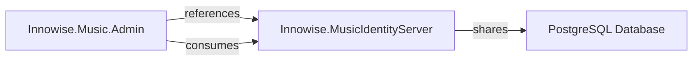
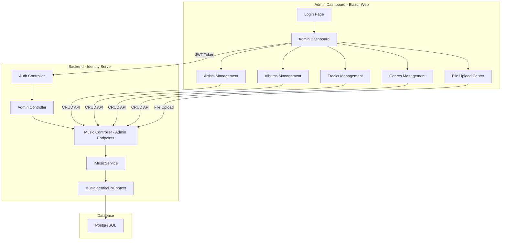
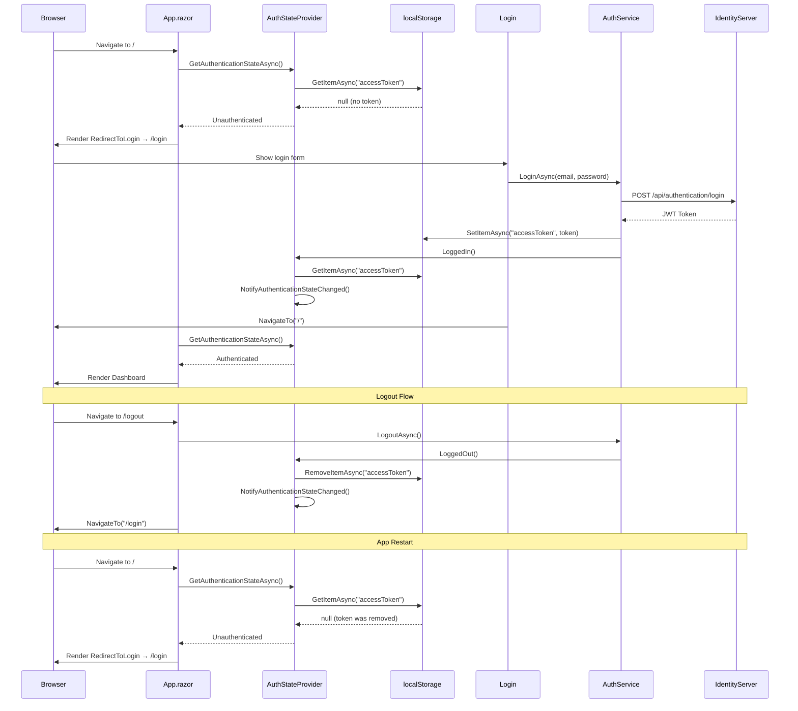

# Admin Dashboard Architecture - Innowise.Music

## Overview

The Admin Dashboard is a Blazor Web application built with .NET 9 that provides content management capabilities for the Innowise.Music streaming platform. It allows administrators to manage the music catalog including artists, albums, tracks, and genres through a web-based interface.

## Solution Integration

The Admin Dashboard will be added as a new project to the existing solution:

```
Innowise.Music.sln
├── Innowise.Music              (MAUI Client - existing)
├── Innowise.MusicIdentityServer (Backend API - existing)
├── Innowise.Music.Admin        (Blazor Web Admin - NEW)
└── docker-compose.dcproj       (Docker orchestration - existing)
```

### Solution File Updates

The `.sln` file will be updated to include the new Admin project:

```
Project("{FAE04EC0-301F-11D3-BF4B-00C04F79EFBC}") = "Innowise.Music.Admin", "Innowise.Music.Admin\Innowise.Music.Admin.csproj", "{NEW-GUID-HERE}"
EndProject
```

### Project Dependencies



The Admin project will:
- Reference the Identity Server project for shared models and DTOs
- Consume the Identity Server APIs via HTTP client
- Share the same database context for direct data access if needed

## Technology Stack

- **Framework**: .NET 9 Blazor Web App
- **UI Framework**: Blazor Server with Razor Components
- **Authentication**: JWT-based using existing Identity Server
- **Authorization**: Role-based (Admin role required)
- **File Upload**: Streaming upload for audio files
- **Database**: PostgreSQL (shared with Identity Server)

## Architecture Diagram



## Authentication & Authorization Flow

### Architecture

The admin dashboard uses Blazor Server's built-in authentication infrastructure with `Blazored.LocalStorage` for token persistence, following the same pattern as the BookStore reference project.

**Key components:**

| Component | File | Purpose |
|-----------|------|---------|
| Auth State Provider | [`Auth/ApiAuthenticationStateProvider.cs`](../Innowise.Music.Admin/Auth/ApiAuthenticationStateProvider.cs) | JWT-based `AuthenticationStateProvider` with `localStorage` persistence |
| Auth Service | [`Services/AuthService.cs`](../Innowise.Music.Admin/Services/AuthService.cs) | Login/logout orchestration, token storage, admin role check |
| App Router | [`Components/App.razor`](../Innowise.Music.Admin/Components/App.razor) | `CascadingAuthenticationState` + `AuthorizeRouteView` with `RedirectToLogin` |
| Login Page | [`Components/Pages/Login.razor`](../Innowise.Music.Admin/Components/Pages/Login.razor) | Credential input and admin verification |
| Logout Page | [`Components/Pages/Logout.razor`](../Innowise.Music.Admin/Components/Pages/Logout.razor) | Token removal and auth state notification |
| Redirect | [`Components/Shared/RedirectToLogin.razor`](../Innowise.Music.Admin/Components/Shared/RedirectToLogin.razor) | Navigates unauthenticated users to `/login` |
| Host Page | [`Pages/_Host.cshtml`](../Innowise.Music.Admin/Pages/_Host.cshtml) | Entry point with `render-mode="Server"` (not `ServerPrerendered`) |

### Token Storage

Tokens are stored in the browser's `localStorage` via **Blazored.LocalStorage** (`ILocalStorageService`):

- **Key**: `"accessToken"`
- **Write**: `AuthService.LoginAsync()` stores JWT after successful API login
- **Read**: `ApiAuthenticationStateProvider.GetAuthenticationStateAsync()` reads and validates on each auth check
- **Delete**: `ApiAuthenticationStateProvider.LoggedOut()` removes token on logout
- **Bearer injection**: `AdminMusicService.AddAuthHeaderAsync()` reads token for API calls

### DI Registration (Program.cs)

```csharp
// Blazored.LocalStorage for browser localStorage access
builder.Services.AddBlazoredLocalStorage();

// Dual registration pattern - both resolve to same scoped instance
builder.Services.AddScoped<ApiAuthenticationStateProvider>();
builder.Services.AddScoped<AuthenticationStateProvider>(p =>
    p.GetRequiredService<ApiAuthenticationStateProvider>());
```

The dual registration is critical: Blazor's infrastructure resolves `AuthenticationStateProvider` (abstract base), while `AuthService` casts to `ApiAuthenticationStateProvider` to call `LoggedIn()`/`LoggedOut()`.

### Route Protection

Routes are protected at two levels:

1. **`App.razor`** wraps the router in `<CascadingAuthenticationState>` and uses `<AuthorizeRouteView>`. Its `<NotAuthorized>` template renders `<RedirectToLogin />` for unauthenticated users.
2. **`@attribute [Authorize]`** on all protected pages (Dashboard, Artists, Albums, Tracks, Genres and their forms). Without this attribute, `AuthorizeRouteView` treats pages as public.

Login and Logout pages do NOT have `[Authorize]` — they are accessible to everyone.

### Workflow



### Prerendering

The `_Host.cshtml` uses `render-mode="Server"` (NOT `ServerPrerendered`). This ensures the Blazor SignalR circuit is established before any component code runs, which is required because `Blazored.LocalStorage` uses JS interop to access `localStorage` — unavailable during prerendering.

## Project Structure

```
Innowise.Music.Admin/
├── Components/
│   ├── Layout/
│   │   ├── MainLayout.razor
│   │   ├── NavMenu.razor
│   │   └── LoginLayout.razor
│   ├── Pages/
│   │   ├── Login.razor
│   │   ├── Dashboard.razor
│   │   ├── Artists/
│   │   │   ├── ArtistsList.razor
│   │   │   └── ArtistForm.razor
│   │   ├── Albums/
│   │   │   ├── AlbumsList.razor
│   │   │   └── AlbumForm.razor
│   │   ├── Tracks/
│   │   │   ├── TracksList.razor
│   │   │   ├── TrackForm.razor
│   │   │   └── TrackUpload.razor
│   │   └── Genres/
│   │       ├── GenresList.razor
│   │       └── GenreForm.razor
│   └── Shared/
│       ├── ConfirmDialog.razor
│       ├── FileUpload.razor
│       └── LoadingSpinner.razor
├── Services/
│   ├── AuthService.cs
│   ├── IAdminMusicService.cs
│   ├── AdminMusicService.cs
│   └── FileUploadService.cs
├── Models/
│   ├── AdminArtistDto.cs
│   ├── AdminAlbumDto.cs
│   ├── AdminTrackDto.cs
│   ├── AdminGenreDto.cs
│   └── UploadTrackRequest.cs
├── wwwroot/
│   ├── css/
│   │   └── admin-styles.css
│   └── images/
├── Program.cs
└── Innowise.Music.Admin.csproj
```

## Backend API Endpoints (Admin)

All admin endpoints require JWT authentication and Admin role.

### Artists Management

| Method | Endpoint | Description |
|--------|----------|-------------|
| GET | `/api/admin/artists` | Get all artists with pagination |
| GET | `/api/admin/artists/{id}` | Get artist by ID |
| POST | `/api/admin/artists` | Create new artist |
| PUT | `/api/admin/artists/{id}` | Update artist |
| DELETE | `/api/admin/artists/{id}` | Delete artist |

### Albums Management

| Method | Endpoint | Description |
|--------|----------|-------------|
| GET | `/api/admin/albums` | Get all albums with pagination |
| GET | `/api/admin/albums/{id}` | Get album by ID |
| POST | `/api/admin/albums` | Create new album |
| PUT | `/api/admin/albums/{id}` | Update album |
| DELETE | `/api/admin/albums/{id}` | Delete album |

### Tracks Management

| Method | Endpoint | Description |
|--------|----------|-------------|
| GET | `/api/admin/tracks` | Get all tracks with pagination |
| GET | `/api/admin/tracks/{id}` | Get track by ID |
| POST | `/api/admin/tracks` | Create new track (metadata only) |
| PUT | `/api/admin/tracks/{id}` | Update track |
| DELETE | `/api/admin/tracks/{id}` | Delete track |
| POST | `/api/admin/tracks/{id}/upload-audio` | Upload audio file for track |

### Genres Management

| Method | Endpoint | Description |
|--------|----------|-------------|
| GET | `/api/admin/genres` | Get all genres |
| GET | `/api/admin/genres/{id}` | Get genre by ID |
| POST | `/api/admin/genres` | Create new genre |
| PUT | `/api/admin/genres/{id}` | Update genre |
| DELETE | `/api/admin/genres/{id}` | Delete genre |

## Database Considerations

### Audio File Storage

Audio files will continue to be stored as BYTEA in PostgreSQL. For production, consider migrating to Azure Blob Storage or AWS S3 with CDN.

### Admin User Management

Admin users will be managed through the existing Identity Server user system with role-based access control.

## Security Considerations

1. **Role-Based Access**: Only users with "Admin" role can access dashboard
2. **JWT Validation**: All API calls must include valid JWT token
3. **File Upload Validation**: Validate audio file types and sizes
4. **Input Sanitization**: Sanitize all user inputs to prevent XSS/SQL injection
5. **HTTPS Only**: All communication must use HTTPS

## Implementation Plan

### Phase 1: Foundation
- [ ] Create Blazor Web App project
- [ ] Set up authentication with existing Identity Server
- [ ] Implement role-based authorization
- [ ] Create base layout and navigation

### Phase 2: CRUD Operations
- [ ] Implement Artist management (list, create, edit, delete)
- [ ] Implement Album management (list, create, edit, delete)
- [ ] Implement Genre management (list, create, edit, delete)
- [ ] Implement Track management (list, create, edit, delete)

### Phase 3: File Upload
- [ ] Create audio file upload component
- [ ] Implement streaming upload to server
- [ ] Add progress tracking and cancellation
- [ ] Validate file types and sizes

### Phase 4: Polish & Testing
- [ ] Add loading states and error handling
- [ ] Implement confirmation dialogs
- [ ] Add search and filtering
- [ ] Write unit and integration tests

## Dependencies

### NuGet Packages (Blazor App)
- `Microsoft.AspNetCore.Components.Web`
- `System.IdentityModel.Tokens.Jwt`
- `Microsoft.AspNetCore.Authorization`

### NuGet Packages (Identity Server - New)
- `Microsoft.AspNetCore.Authentication.JwtBearer` (already present)
- `Microsoft.AspNetCore.Authorization` (already present)

## File Upload Specification

### Audio File Requirements
- **Supported Formats**: MP3, WAV, FLAC, AAC
- **Maximum Size**: 50MB per file
- **Streaming Upload**: Use `IFormFile` with streaming to handle large files

### Upload Process
1. User selects audio file
2. Client validates file type and size
3. File is streamed to server in chunks
4. Server validates and stores in database
5. Track metadata is updated with audio info

## Error Handling

All operations should include proper error handling:
- Network errors
- Validation errors
- Authorization failures
- File upload failures
- Database constraints

## Performance Considerations

1. **Pagination**: All list views should support pagination
2. **Lazy Loading**: Load related data on demand
3. **Caching**: Cache frequently accessed data (genres, artists)
4. **Async Operations**: All I/O operations should be async
5. **File Streaming**: Stream large audio files instead of loading into memory

## Future Enhancements

1. **Bulk Operations**: Import multiple tracks from CSV
2. **Analytics Dashboard**: View listening statistics
3. **User Management**: Admin interface for managing users
4. **Content Moderation**: Review and approve user-generated content
5. **Backup & Restore**: Database backup functionality

## Troubleshooting & Common Issues

### Authentication Issues in Docker

If you're experiencing authentication issues when running the Admin Dashboard in Docker but it works from the mobile app or Postman, the issue is likely related to Docker network DNS resolution.

#### Root Cause

Docker Compose uses **service names** (not container names) for internal DNS resolution. The Identity Server service name is `innowise.musicidentityserver`, but the Admin Dashboard was configured to use `music_identity_server` (the container name). This causes the Admin container to fail when trying to reach the Identity Server API.

#### Solution: Update Base URL Configuration

**Option 1: Update docker-compose.yml (Recommended)**

Change the `ApiSettings__BaseUrl` environment variable to use the service name:

```yaml
innowise.music.admin:
  environment:
    - ApiSettings__BaseUrl=http://innowise.musicidentityserver:8080/api
```

**Option 2: Add network aliases**

Add a network alias to the Identity Server service so it responds to both names:

```yaml
innowise.musicidentityserver:
  networks:
    default:
      aliases:
        - music_identity_server
```

#### Diagnostic Commands

To verify the issue:

```bash
# Test DNS resolution from Admin container
docker exec music_admin_dashboard nslookup innowise.musicidentityserver
docker exec music_admin_dashboard nslookup music_identity_server

# Test API connectivity
docker exec music_admin_dashboard curl -v http://innowise.musicidentityserver:8080/api/health
```

#### Configuration Reference

| Environment | Service Name | Container Name | Base URL | Port |
|-------------|--------------|----------------|----------|------|
| Development (VS Debug) | N/A | N/A | `https://localhost:7008/api` | 7008 (HTTPS) |
| Docker Compose | `innowise.musicidentityserver` | `music_identity_server` | `https://music_identity_server:8081/api` | 8081 (HTTPS internal) |

### Deployment Modes

The Admin Dashboard supports two deployment modes with different API endpoint configurations:

#### Mode 1: Development (Visual Studio Debug)

In this mode, the Admin Dashboard runs directly from Visual Studio while the Identity Server runs in a Docker container.

**Configuration:**
- **File**: `appsettings.Development.json`
- **Base URL**: `https://localhost:7008/api`
- **How it works**: The Identity Server container exposes port 7008 (HTTPS) to the host machine. The Admin app connects to localhost:7008 to reach the Identity Server.

**Start sequence:**
1. Start Identity Server container: `docker-compose up innowise.musicidentityserver`
2. Run Admin Dashboard from Visual Studio (F5)

#### Mode 2: Docker Compose (Containerized)

Both Admin Dashboard and Identity Server run in Docker containers within the same network.

**Configuration:**
- **File**: `appsettings.json` (overridden by `docker-compose.yml` environment variable)
- **Base URL**: `https://music_identity_server:8081/api`
- **How it works**: Containers communicate via Docker's internal DNS using service names. The Admin container connects to `music_identity_server` (alias for `innowise.musicidentityserver`) on port 8081 (HTTPS).

**Start sequence:**
1. Start all services: `docker-compose up`
2. Access Admin Dashboard at `http://localhost:5237`

#### Environment Variable Override

The `docker-compose.yml` sets the API base URL via environment variable, which takes precedence over `appsettings.json`:

```yaml
innowise.music.admin:
  environment:
    - ApiSettings__BaseUrl=https://music_identity_server:8081/api
```

This allows the same `appsettings.json` to be used across different environments while still allowing overrides when needed.

#### Other Common Issues

1. **Container startup order** - The Admin container may start before Identity Server is ready. Add a health check dependency.
2. **CORS configuration** - Ensure Identity Server allows requests from the Admin origin.