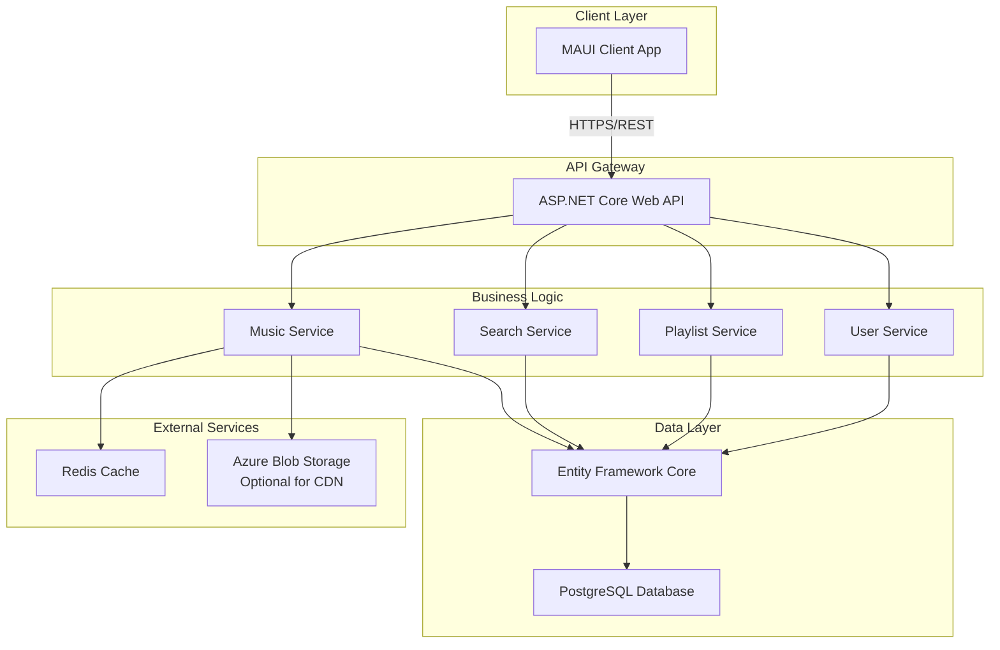
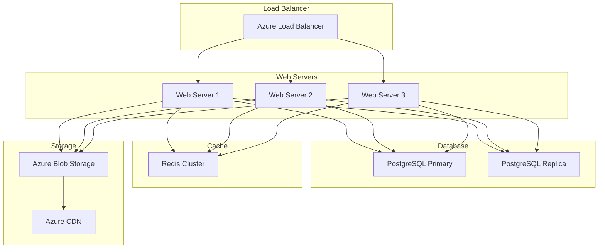

# Music Streaming Architecture Design

## Overview

This document outlines the architectural design for implementing a full-featured music streaming service similar to Spotify or Yandex Music. The system will store audio files in PostgreSQL blob fields and provide comprehensive APIs for music discovery, search, and playback.

## System Architecture



## Database Schema Design

### Core Tables

#### 1. Artists Table
```sql
CREATE TABLE Artists (
    Id UUID PRIMARY KEY DEFAULT gen_random_uuid(),
    Name VARCHAR(255) NOT NULL,
    Biography TEXT,
    ImageUrl VARCHAR(500),
    Verified BOOLEAN DEFAULT FALSE,
    MonthlyListeners BIGINT DEFAULT 0,
    CreatedAt TIMESTAMP WITH TIME ZONE DEFAULT NOW(),
    UpdatedAt TIMESTAMP WITH TIME ZONE DEFAULT NOW()
);

CREATE INDEX idx_artists_name ON Artists USING GIN(to_tsvector('english', Name));
```

#### 2. Albums Table
```sql
CREATE TABLE Albums (
    Id UUID PRIMARY KEY DEFAULT gen_random_uuid(),
    Title VARCHAR(255) NOT NULL,
    ArtistId UUID REFERENCES Artists(Id) ON DELETE CASCADE,
    ReleaseDate DATE,
    CoverImageUrl VARCHAR(500),
    Genre VARCHAR(100),
    Label VARCHAR(255),
    TotalTracks INTEGER DEFAULT 0,
    Duration INTEGER, -- in seconds
    CreatedAt TIMESTAMP WITH TIME ZONE DEFAULT NOW(),
    UpdatedAt TIMESTAMP WITH TIME ZONE DEFAULT NOW()
);

CREATE INDEX idx_albums_title ON Albums USING GIN(to_tsvector('english', Title));
CREATE INDEX idx_albums_artist ON Albums(ArtistId);
```

#### 3. Tracks Table
```sql
CREATE TABLE Tracks (
    Id UUID PRIMARY KEY DEFAULT gen_random_uuid(),
    Title VARCHAR(255) NOT NULL,
    ArtistId UUID REFERENCES Artists(Id) ON DELETE SET NULL,
    AlbumId UUID REFERENCES Albums(Id) ON DELETE SET NULL,
    TrackNumber INTEGER,
    Duration INTEGER NOT NULL, -- in seconds
    AudioData BYTEA, -- Binary audio data (stored in chunks for large files)
    AudioFormat VARCHAR(50) DEFAULT 'MP3', -- MP3, FLAC, WAV, etc.
    Bitrate INTEGER, -- kbps
    SampleRate INTEGER, -- Hz
    FileSize BIGINT, -- bytes
    ISRC VARCHAR(12), -- International Standard Recording Code
    Explicit BOOLEAN DEFAULT FALSE,
    PlayCount BIGINT DEFAULT 0,
    CreatedAt TIMESTAMP WITH TIME ZONE DEFAULT NOW(),
    UpdatedAt TIMESTAMP WITH TIME ZONE DEFAULT NOW()
);

CREATE INDEX idx_tracks_title ON Tracks USING GIN(to_tsvector('english', Title));
CREATE INDEX idx_tracks_artist ON Tracks(ArtistId);
CREATE INDEX idx_tracks_album ON Tracks(AlbumId);
CREATE INDEX idx_tracks_playcount ON Tracks(PlayCount DESC);
```

#### 4. Genres Table
```sql
CREATE TABLE Genres (
    Id UUID PRIMARY KEY DEFAULT gen_random_uuid(),
    Name VARCHAR(100) UNIQUE NOT NULL,
    Description TEXT,
    ImageUrl VARCHAR(500),
    Color VARCHAR(7) -- Hex color for UI
);

CREATE INDEX idx_genres_name ON Genres USING GIN(to_tsvector('english', Name));
```

#### 5. TrackGenres Junction Table
```sql
CREATE TABLE TrackGenres (
    TrackId UUID REFERENCES Tracks(Id) ON DELETE CASCADE,
    GenreId UUID REFERENCES Genres(Id) ON DELETE CASCADE,
    PRIMARY KEY (TrackId, GenreId)
);
```

#### 6. FeaturedArtists Junction Table (for collaborations)
```sql
CREATE TABLE FeaturedArtists (
    TrackId UUID REFERENCES Tracks(Id) ON DELETE CASCADE,
    ArtistId UUID REFERENCES Artists(Id) ON DELETE CASCADE,
    PRIMARY KEY (TrackId, ArtistId)
);
```

### User-Related Tables

#### 7. UserPlaylists Table
```sql
CREATE TABLE UserPlaylists (
    Id UUID PRIMARY KEY DEFAULT gen_random_uuid(),
    UserId VARCHAR(255) NOT NULL, -- ASP.NET Identity UserId
    Name VARCHAR(255) NOT NULL,
    Description TEXT,
    CoverImageUrl VARCHAR(500),
    IsPublic BOOLEAN DEFAULT FALSE,
    IsCollaborative BOOLEAN DEFAULT FALSE,
    CreatedAt TIMESTAMP WITH TIME ZONE DEFAULT NOW(),
    UpdatedAt TIMESTAMP WITH TIME ZONE DEFAULT NOW()
);

CREATE INDEX idx_userplaylists_user ON UserPlaylists(UserId);
CREATE INDEX idx_userplaylists_public ON UserPlaylists(IsPublic) WHERE IsPublic = TRUE;
```

#### 8. PlaylistTracks Junction Table
```sql
CREATE TABLE PlaylistTracks (
    PlaylistId UUID REFERENCES UserPlaylists(Id) ON DELETE CASCADE,
    TrackId UUID REFERENCES Tracks(Id) ON DELETE CASCADE,
    AddedByUserId VARCHAR(255),
    AddedAt TIMESTAMP WITH TIME ZONE DEFAULT NOW(),
    Position INTEGER,
    PRIMARY KEY (PlaylistId, TrackId)
);

CREATE INDEX idx_playlisttracks_playlist ON PlaylistTracks(PlaylistId);
```

#### 9. UserLikedTracks Table
```sql
CREATE TABLE UserLikedTracks (
    UserId VARCHAR(255) NOT NULL,
    TrackId UUID REFERENCES Tracks(Id) ON DELETE CASCADE,
    LikedAt TIMESTAMP WITH TIME ZONE DEFAULT NOW(),
    PRIMARY KEY (UserId, TrackId)
);

CREATE INDEX idx_userlikedtracks_user ON UserLikedTracks(UserId);
CREATE INDEX idx_userlikedtracks_track ON UserLikedTracks(TrackId);
```

#### 10. UserFollowedArtists Table
```sql
CREATE TABLE UserFollowedArtists (
    UserId VARCHAR(255) NOT NULL,
    ArtistId UUID REFERENCES Artists(Id) ON DELETE CASCADE,
    FollowedAt TIMESTAMP WITH TIME ZONE DEFAULT NOW(),
    PRIMARY KEY (UserId, ArtistId)
);

CREATE INDEX idx_userfollowedartists_user ON UserFollowedArtists(UserId);
```

#### 11. UserListeningHistory Table
```sql
CREATE TABLE UserListeningHistory (
    Id UUID PRIMARY KEY DEFAULT gen_random_uuid(),
    UserId VARCHAR(255) NOT NULL,
    TrackId UUID REFERENCES Tracks(Id) ON DELETE CASCADE,
    PlayedAt TIMESTAMP WITH TIME ZONE DEFAULT NOW(),
    PlayDuration INTEGER, -- seconds listened
    Completed BOOLEAN DEFAULT FALSE
);

CREATE INDEX idx_userlisteninghistory_user ON UserListeningHistory(UserId);
CREATE INDEX idx_userlisteninghistory_track ON UserListeningHistory(TrackId);
CREATE INDEX idx_userlisteninghistory_playedat ON UserListeningHistory(PlayedAt DESC);
```

### Search and Recommendations

#### 12. SearchHistory Table
```sql
CREATE TABLE SearchHistory (
    Id UUID PRIMARY KEY DEFAULT gen_random_uuid(),
    UserId VARCHAR(255),
    Query VARCHAR(255) NOT NULL,
    SearchedAt TIMESTAMP WITH TIME ZONE DEFAULT NOW()
);

CREATE INDEX idx_searchhistory_user ON SearchHistory(UserId);
CREATE INDEX idx_searchhistory_query ON SearchHistory USING GIN(to_tsvector('english', Query));
```

## API Design

### Base URL Pattern
```
https://api.innowisemusic.com/api/v1/
```

### Authentication Endpoints
| Method | Endpoint | Description |
|--------|----------|-------------|
| POST | `/auth/login` | User login |
| POST | `/auth/register` | User registration |
| POST | `/auth/refresh` | Refresh token |
| POST | `/auth/logout` | User logout |

### Phase 1: Essential Endpoints (MVP)

These 5 core endpoints are the minimum required to play music and provide a basic streaming experience:

#### 1. Search Tracks
| Method | Endpoint | Description |
|--------|----------|-------------|
| GET | `/music/tracks?query={q}&page={p}&pageSize={s}` | Search tracks by title, artist, or album with pagination |

**Query Parameters:**
- `query` (required): Search term
- `page` (optional): Page number (default: 1)
- `pageSize` (optional): Items per page (default: 20, max: 50)

**Response:**
```json
{
  "items": [
    {
      "id": "uuid",
      "title": "Song Title",
      "artist": { "id": "uuid", "name": "Artist Name" },
      "album": { "id": "uuid", "title": "Album Title", "coverUrl": "url" },
      "duration": 180,
      "trackNumber": 1
    }
  ],
  "totalCount": 100,
  "page": 1,
  "pageSize": 20
}
```

#### 2. Get Track Details
| Method | Endpoint | Description |
|--------|----------|-------------|
| GET | `/music/tracks/{id}` | Get detailed information about a specific track |

**Response:**
```json
{
  "id": "uuid",
  "title": "Song Title",
  "artist": { "id": "uuid", "name": "Artist Name" },
  "album": { "id": "uuid", "title": "Album Title", "coverUrl": "url" },
  "duration": 180,
  "trackNumber": 1,
  "genre": "Rock",
  "releaseDate": "2024-01-01",
  "playCount": 1000000
}
```

#### 3. Stream Audio
| Method | Endpoint | Description |
|--------|----------|-------------|
| GET | `/music/tracks/{id}/stream` | Get audio stream for playback (supports range requests) |

**Features:**
- Supports HTTP range requests for seeking
- Returns appropriate Content-Type (audio/mpeg, audio/flac, etc.)
- Includes cache headers for CDN optimization

**Response Headers:**
```
Content-Type: audio/mpeg
Content-Length: 4567890
Accept-Ranges: bytes
Cache-Control: public, max-age=31536000
```

#### 4. Get Artist's Top Tracks
| Method | Endpoint | Description |
|--------|----------|-------------|
| GET | `/music/artists/{id}/top-tracks?count={n}` | Get most popular tracks by artist |

**Query Parameters:**
- `count` (optional): Number of tracks (default: 10, max: 50)

**Response:**
```json
{
  "artist": { "id": "uuid", "name": "Artist Name" },
  "tracks": [
    {
      "id": "uuid",
      "title": "Popular Song",
      "duration": 200,
      "playCount": 5000000
    }
  ]
}
```

#### 5. Get Album Tracks
| Method | Endpoint | Description |
|--------|----------|-------------|
| GET | `/music/albums/{id}/tracks` | Get all tracks from an album in order |

**Response:**
```json
{
  "album": { "id": "uuid", "title": "Album Title", "coverUrl": "url" },
  "tracks": [
    {
      "id": "uuid",
      "title": "Track 1",
      "duration": 180,
      "trackNumber": 1,
      "artist": { "id": "uuid", "name": "Artist Name" }
    }
  ],
  "totalDuration": 3600
}
```

---

### Phase 2+: Future Endpoints (To Be Implemented Later)

These endpoints will be added in subsequent phases to enhance the user experience:

#### User Library
- `GET /me/playlists` - Get user's playlists
- `POST /me/playlists` - Create new playlist
- `PUT /me/tracks/{id}` - Like a track
- `DELETE /me/tracks/{id}` - Unlike a track
- `GET /me/tracks` - Get liked tracks

#### Advanced Search
- `GET /search/suggestions` - Search autocomplete
- `GET /search?query={q}&type=all` - Universal search

#### Recommendations
- `GET /music/home` - Personalized home page
- `GET /music/featured` - Featured playlists
- `GET /music/new-releases` - New releases

#### Social Features
- `POST /artists/{id}/follow` - Follow artist
- `GET /me/following` - Get followed artists
- `POST /tracks/{id}/play` - Record play history

---

### Audio Streaming Details

#### Stream Endpoint Specification
```
GET /music/tracks/{id}/stream
```

**Optional Query Parameters:**
- `quality`: `low` (128kbps), `medium` (256kbps), `high` (320kbps)
- `format`: `mp3`, `flac` (default: mp3)

**Range Request Support:**
```
GET /music/tracks/{id}/stream
Range: bytes=0-1023
```

**Response:**
```
HTTP/1.1 206 Partial Content
Content-Type: audio/mpeg
Content-Length: 1024
Content-Range: bytes 0-1023/4567890
Accept-Ranges: bytes
Cache-Control: public, max-age=31536000
```

## Service Layer Architecture

### 1. MusicService
```csharp
public interface IMusicService
{
    Task<TrackDto> GetTrackAsync(Guid id);
    Task<Stream> GetTrackAudioAsync(Guid trackId, AudioQuality quality);
    Task<TrackPageResult> SearchTracksAsync(string query, int page, int pageSize);
    Task<ArtistDto> GetArtistAsync(Guid id);
    Task<AlbumDto> GetAlbumAsync(Guid id);
    Task<IEnumerable<TrackDto>> GetTopTracksAsync(string genre, int count);
    Task<IEnumerable<AlbumDto>> GetNewReleasesAsync(int count);
    Task<IEnumerable<PlaylistDto>> GetFeaturedPlaylistsAsync();
}
```

### 2. SearchService
```csharp
public interface ISearchService
{
    Task<SearchResultDto> SearchAsync(string query, SearchFilter filter);
    Task<IEnumerable<string>> GetSuggestionsAsync(string query);
    Task RecordSearchAsync(string userId, string query);
}
```

### 3. PlaylistService
```csharp
public interface IPlaylistService
{
    Task<PlaylistDto> CreatePlaylistAsync(string userId, CreatePlaylistDto dto);
    Task<PlaylistDto> GetPlaylistAsync(Guid id);
    Task<PlaylistDto> UpdatePlaylistAsync(Guid id, UpdatePlaylistDto dto);
    Task DeletePlaylistAsync(Guid id);
    Task AddTracksToPlaylistAsync(Guid playlistId, IEnumerable<Guid> trackIds);
    Task RemoveTracksFromPlaylistAsync(Guid playlistId, IEnumerable<Guid> trackIds);
    Task ReorderPlaylistTracksAsync(Guid playlistId, int fromIndex, int toIndex);
}
```

### 4. UserService
```csharp
public interface IUserMusicService
{
    Task<IEnumerable<TrackDto>> GetLikedTracksAsync(string userId);
    Task LikeTrackAsync(string userId, Guid trackId);
    Task UnlikeTrackAsync(string userId, Guid trackId);
    Task<bool> IsTrackLikedAsync(string userId, Guid trackId);
    
    Task<IEnumerable<ArtistDto>> GetFollowedArtistsAsync(string userId);
    Task FollowArtistAsync(string userId, Guid artistId);
    Task UnfollowArtistAsync(string userId, Guid artistId);
    
    Task RecordListeningHistoryAsync(string userId, Guid trackId, int duration);
    Task<IEnumerable<TrackDto>> GetRecentlyPlayedAsync(string userId, int count);
}
```

## Caching Strategy

### Redis Cache Layers

1. **Track Metadata Cache** (TTL: 24 hours)
   - Track details, artist info, album info
   - Key pattern: `track:{id}`, `artist:{id}`, `album:{id}`

2. **User Library Cache** (TTL: 1 hour)
   - Liked tracks, playlists, followed artists
   - Key pattern: `user:{userId}:liked`, `user:{userId}:playlists`

3. **Search Results Cache** (TTL: 30 minutes)
   - Popular search queries
   - Key pattern: `search:{queryHash}`

4. **Audio Stream Cache** (TTL: 1 hour)
   - Stream URLs for frequently played tracks
   - Key pattern: `stream:{trackId}:{quality}`

## Performance Optimizations

### 1. Database Optimizations
- **Partitioning**: Partition `UserListeningHistory` by month
- **Indexing**: Full-text search indexes on name/title fields
- **Connection Pooling**: Configure Npgsql connection pooling
- **Read Replicas**: For read-heavy operations

### 2. Audio Streaming Optimizations
- **Chunked Storage**: Store large audio files in chunks (max 10MB per chunk)
- **CDN Integration**: Optional Azure Blob Storage + CDN for audio delivery
- **Adaptive Bitrate**: Transcode to multiple bitrates (128kbps, 256kbps, 320kbps)
- **Range Request Support**: Enable seeking in audio player

### 3. API Optimizations
- **Pagination**: All list endpoints support pagination
- **Field Selection**: Allow clients to specify required fields
- **Batch Operations**: Support batch like/follow operations
- **Compression**: Enable gzip compression for JSON responses

## Security Considerations

### 1. Authentication & Authorization
- JWT tokens for API authentication
- Role-based access control (Admin, User, Premium)
- Rate limiting per user/IP

### 2. Audio Streaming Security
- Signed URLs with expiration for audio streams
- Token validation for each stream request
- Prevent direct blob access

### 3. Data Protection
- Encrypt sensitive user data at rest
- HTTPS for all API communication
- Input validation and sanitization

## Deployment Architecture



## Migration Strategy

### Phase 1: Core Music Library
1. Implement database schema
2. Create music CRUD APIs
3. Build admin interface for content management
4. Implement basic search

### Phase 2: User Features
1. Implement user library (playlists, likes)
2. Add listening history
3. Implement following system
4. Build recommendation engine

### Phase 3: Advanced Features
1. Implement advanced search with filters
2. Add social features (shared playlists)
3. Implement analytics and insights
4. Add premium features

### Phase 4: Performance & Scale
1. Implement caching layer
2. Add CDN for audio streaming
3. Optimize database queries
4. Implement monitoring and alerting

## Monitoring & Analytics

### Key Metrics
- **API Performance**: Response times, error rates
- **User Engagement**: Daily active users, session duration
- **Content Metrics**: Most played tracks, user growth
- **System Health**: CPU, memory, database connections

### Logging Strategy
- Structured logging with Serilog
- Log aggregation with Seq/ELK stack
- Performance profiling with Application Insights
- Error tracking with Sentry

## Conclusion

This architecture provides a scalable, performant foundation for a music streaming service. The design supports:

- **Scalability**: Horizontal scaling for web servers, read replicas for database
- **Performance**: Caching, CDN, optimized queries
- **Security**: Authentication, authorization, encrypted storage
- **Maintainability**: Clean architecture, separation of concerns
- **Extensibility**: Easy to add new features and integrations

The blob storage approach for audio files keeps everything in PostgreSQL, simplifying backup and consistency, while optional CDN integration ensures fast streaming globally.
