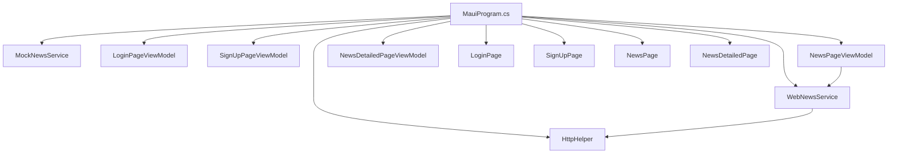
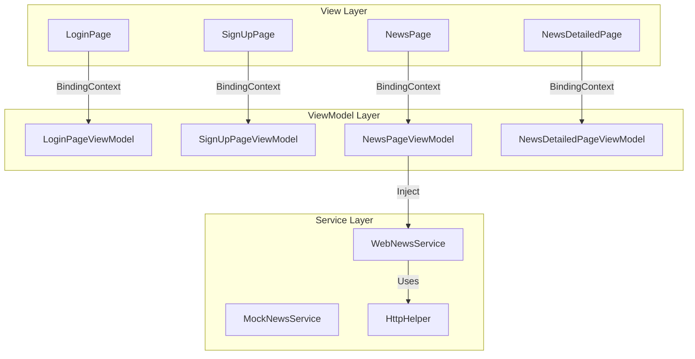
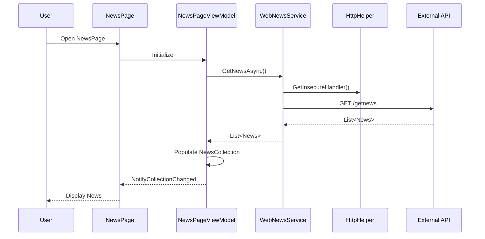
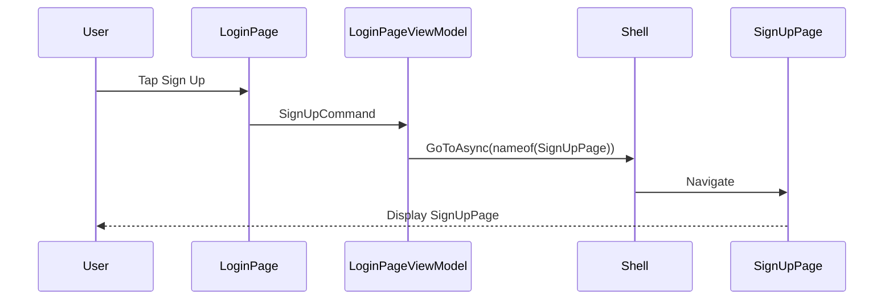

# Project Architecture - Innowise.Music

## Overview
Innowise.Music is a cross-platform audio streaming application built with .NET 9 MAUI. The application follows the MVVM pattern and targets iOS, Android, macOS, and Windows platforms.

## Technology Stack
- **Framework**: .NET 9 MAUI
- **Architecture**: MVVM with CommunityToolkit.Mvvm
- **Database**: PostgreSQL
- **Dependency Injection**: Microsoft.Extensions.DependencyInjection
- **Navigation**: Shell-based navigation

## Project Structure

```
Innowise.Music/
├── Model/                    # Data models
│   └── News.cs
├── View/                     # XAML pages
│   ├── LoginPage.xaml(.cs)
│   ├── SignUpPage.xaml(.cs)
│   ├── NewsPage.xaml(.cs)
│   └── NewsDetailedPage.xaml(.cs)
├── ViewModel/                # ViewModels
│   ├── LoginPageViewModel.cs
│   ├── SignUpPageViewModel.cs
│   ├── NewsPageViewModel.cs
│   └── NewsDetailedPageViewModel.cs
├── Services/                 # Business logic
│   ├── INewsService.cs
│   ├── WebNewsService.cs
│   ├── MockNewsService.cs
│   ├── IHttpHelper.cs
│   └── HttpClientHelper.cs
├── Resources/                # Fonts, images, styles
│   └── Styles/
│       ├── Colors.xaml
│       └── Styles.xaml
├── App.xaml                  # Application resources
├── AppShell.xaml.cs          # Shell navigation
├── MauiProgram.cs            # DI configuration
└── Innowise.Music.csproj     # Project file
```

## Component Architecture

### Dependency Injection Graph



### Navigation Flow

```mermaid
graph LR
    A[AppShell] -->|RegisterRoute| B[SignUpPage]
    C[LoginPage] -->|SignUpCommand| B
    B -->|LoginCommand| D[//LoginPage]
    E[NewsPage] -->|GoToDetailsCommand| F[NewsDetailedPage]
    F -->|QueryProperty| G[NewsDetailedPageViewModel]
```

### MVVM Communication



## Core Components

### 1. Authentication Module
**Files**: `LoginPage.xaml`, `SignUpPage.xaml`, `LoginPageViewModel.cs`, `SignUpPageViewModel.cs`

**Responsibilities**:
- User authentication UI
- Navigation between login/signup flows
- Future: Integration with identity service

**Dependencies**: None (core UI)

### 2. News Module
**Files**: `NewsPage.xaml`, `NewsDetailedPage.xaml`, `NewsPageViewModel.cs`, `NewsDetailedPageViewModel.cs`, `News.cs`

**Responsibilities**:
- Display news feed
- Show news details
- API integration for news retrieval

**Dependencies**: `WebNewsService`, `HttpHelper`

### 3. Services Layer
**Files**: `INewsService.cs`, `WebNewsService.cs`, `MockNewsService.cs`, `IHttpHelper.cs`, `HttpClientHelper.cs`

**Responsibilities**:
- HTTP client configuration
- News API communication
- Mock data for development

**Dependencies**: `HttpClient`

## Data Flow

### News Retrieval Flow



### Navigation Flow (Login to SignUp)



## Key Design Decisions

### 1. MVVM with CommunityToolkit.Mvvm
- **Why**: Reduces boilerplate code
- **Benefits**: `[ObservableObject]`, `[RelayCommand]`, `[ObservableProperty]`

### 2. Shell Navigation
- **Why**: Built-in MAUI navigation
- **Benefits**: Type-safe routes, parameter passing

### 3. Dependency Injection
- **Why**: Loose coupling, testability
- **Implementation**: All Pages and ViewModels registered as singletons

### 4. Compiled Bindings
- **Why**: Performance, compile-time checking
- **Implementation**: `x:DataType` on all ContentPages

## Current Status

### Completed
- ✅ Project infrastructure
- ✅ Authentication UI (Login/SignUp)
- ✅ News listing and details
- ✅ API integration layer
- ✅ MVVM architecture

### In Progress
- 🔄 Documentation

### Planned
- ⏳ Audio playback service
- ⏳ Music library with PostgreSQL
- ⏳ Search functionality
- ⏳ User profile
- ⏳ Favorites and playlists
- ⏳ Background playback

## API Endpoints

### News Service
| Method | Endpoint | Description |
|--------|----------|-------------|
| GET | `/getnews` | Retrieve all news items |

**Base URL**:
- Android Emulator: `https://10.0.2.2:7008`
- Desktop/Other: `https://localhost:7008`

## Coding Standards

Refer to `QWEN.md` for detailed coding standards. Key points:
- PascalCase for classes, methods, public members
- camelCase with underscore prefix for private fields
- Interface names prefixed with "I"
- MVVM with `[ObservableObject]` and `[RelayCommand]`
- Async/await for I/O operations
- DI for all dependencies

## Testing Strategy

### Unit Tests (Planned)
- ViewModel command execution
- Service methods
- Model validation

### Integration Tests (Planned)
- API endpoints
- Navigation flows
- Database operations

## Security Considerations

### Current
- HTTPS for all API calls
- SSL bypass for localhost development (HttpHelper)

### Planned
- JWT authentication
- Secure token storage
- OAuth 2.0 for Google SSO
- Encrypted local storage
