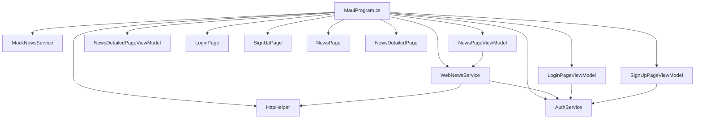
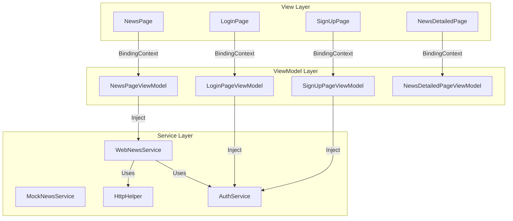
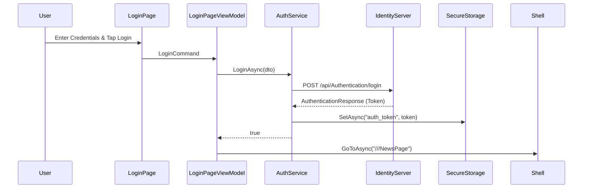
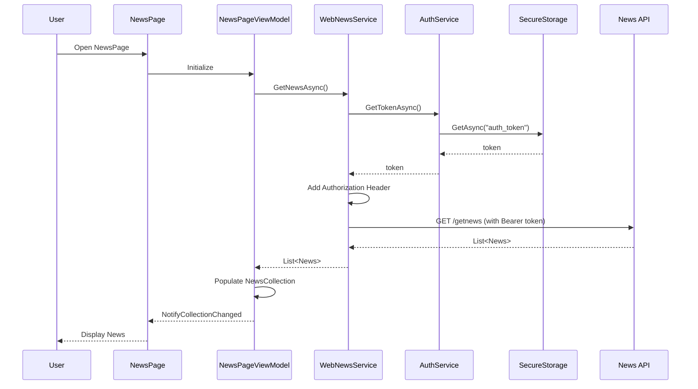

# Project Architecture - Innowise.Music

## Overview
Innowise.Music is a cross-platform audio streaming application built with .NET 9 MAUI. The application follows the MVVM pattern and targets iOS, Android, macOS, and Windows platforms.

## Technology Stack
- **Framework**: .NET 9 MAUI
- **Backend Architecture**: ASP.NET Core Identity Server, Docker Compose
- **Architecture**: MVVM with CommunityToolkit.Mvvm
- **Database**: PostgreSQL
- **Logging**: Seq
- **Dependency Injection**: Microsoft.Extensions.DependencyInjection
- **Navigation**: Shell-based navigation

## Project Structure

```
Innowise.Music/ (Root)
├── Innowise.Music.sln        # Main solution file
├── docker-compose.yml        # Docker orchestration
├── Innowise.Music/           # MAUI Client Application
│   ├── Model/                # Data models
│   ├── View/                 # XAML pages
│   ├── ViewModel/            # ViewModels
│   ├── Services/             # Business logic
│   ├── Resources/            # Fonts, images, styles
│   ├── App.xaml              # Application resources
│   ├── AppShell.xaml.cs      # Shell navigation
│   ├── MauiProgram.cs        # DI configuration
│   └── Innowise.Music.csproj # Project file
├── Innowise.MusicIdentityServer/ # Backend Identity Server
│   ├── Controllers/          # API Controllers
│   ├── Data/                 # DB Context and Entities
│   ├── Models/               # DTOs
│   ├── Migrations/           # EF Core Migrations
│   ├── Program.cs            # Server entry point
│   └── Innowise.MusicIdentityServer.csproj
└── Docs/                     # Project documentation
    ├── changelog.md
    ├── project.md
    └── tasktracker.md
```

## Component Architecture

### Dependency Injection Graph



### Navigation Flow

```mermaid
graph LR
    A[AppShell] -->|RegisterRoute| B[SignUpPage]
    C[LoginPage] -->|SignUpCommand| B
    B -->|LoginCommand| D[//LoginPage]
    E[NewsPage] -->|GoToDetailsCommand| F[NewsDetailedPage]
    F -->|QueryProperty| G[NewsDetailedPageViewModel]
    H[App] -->|CheckAuth| C
    H -->|CheckAuth| E
```

### MVVM Communication



## Core Components

### 1. Authentication Module
**Files**: `LoginPage.xaml`, `SignUpPage.xaml`, `LoginPageViewModel.cs`, `SignUpPageViewModel.cs`, `IAuthService.cs`, `AuthService.cs`, `LoginUserDto.cs`, `UserDto.cs`, `AuthenticationResponse.cs`

**Responsibilities**:
- User authentication UI
- Navigation between login/signup flows
- JWT-based authentication using `SecureStorage`
- Interaction with `Innowise.MusicIdentityServer`

**Dependencies**: `IAuthService`, `SecureStorage`, `System.IdentityModel.Tokens.Jwt`

### 2. News Module
**Files**: `NewsPage.xaml`, `NewsDetailedPage.xaml`, `NewsPageViewModel.cs`, `NewsDetailedPageViewModel.cs`, `News.cs`

**Responsibilities**:
- Display news feed
- Show news details
- API integration for news retrieval with Bearer token support

**Dependencies**: `WebNewsService`, `HttpHelper`, `IAuthService`

### 3. Services Layer
**Files**: `INewsService.cs`, `WebNewsService.cs`, `MockNewsService.cs`, `IHttpHelper.cs`, `HttpClientHelper.cs`, `IAuthService.cs`, `AuthService.cs`

**Responsibilities**:
- HTTP client configuration
- News API communication
- Mock data for development
- User authentication and token management

**Dependencies**: `HttpClient`, `SecureStorage`

## Data Flow

### Authentication Flow (Login)



### News Retrieval Flow (Authenticated)



## Key Design Decisions

### 5. JWT Authentication with SecureStorage
- **Why**: Standard for securing mobile applications
- **Benefits**: Persistence across sessions, secure storage of sensitive tokens, automatic inclusion in API requests.

### 6. Startup Auth Check
- **Why**: Seamless user experience
- **Benefits**: Automatically redirects authenticated users to the main content, reducing friction.

## Current Status

### Completed
- ✅ Project infrastructure
- ✅ Authentication UI (Login/SignUp)
- ✅ News listing and details
- ✅ API integration layer
- ✅ MVVM architecture
- ✅ JWT Authentication Implementation
- ✅ Secure Token Storage
- ✅ Authenticated API Requests

## API Endpoints

### Identity & News Service (Unified)
| Method | Endpoint | Description |
|--------|----------|-------------|
| POST | `/api/Authentication/login` | User login |
| POST | `/api/Authentication/register` | User registration |
| GET | `/getnews` | Retrieve all news items |

**Base URL (HTTPS)**:
- Android Emulator: `https://10.0.2.2:7008`
- Desktop/iOS Simulator: `https://localhost:7008`

## Coding Standards

Refer to `QWEN.md` for detailed coding standards. Key points:
- PascalCase for classes, methods, public members
- camelCase with underscore prefix for private fields
- Interface names prefixed with "I"
- MVVM with `[ObservableObject]` and `[RelayCommand]`
- Async/await for I/O operations
- DI for all dependencies

## Testing Strategy

### Unit Tests (Planned)
- ViewModel command execution
- Service methods
- Model validation

### Integration Tests (Planned)
- API endpoints
- Navigation flows
- Database operations

## Security Considerations

### Current
- HTTPS for all API calls
- SSL bypass for localhost development (HttpHelper)
- **Secrets Management**: Docker Compose secrets (database passwords, Kestrel certificates) are managed via a local `.env` file, which is strictly excluded from source control.

### Planned
- JWT authentication
- Secure token storage
- OAuth 2.0 for Google SSO
- Encrypted local storage
