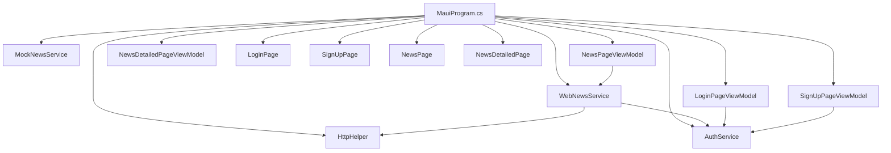
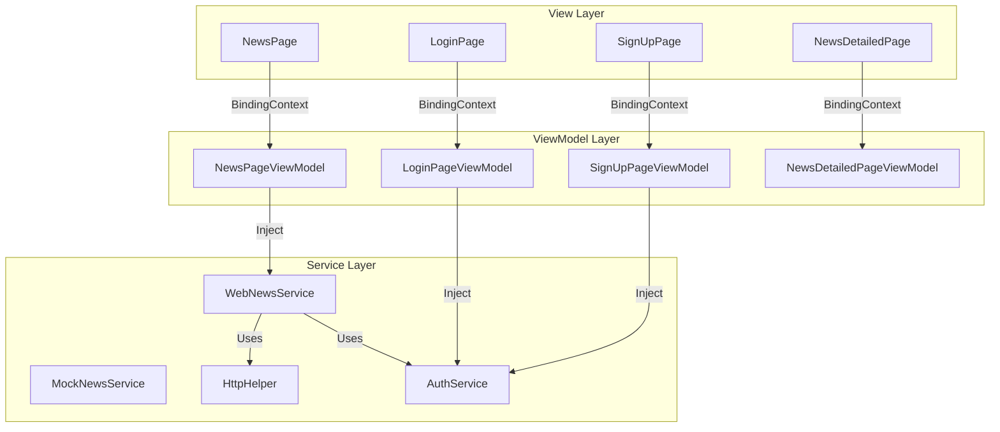
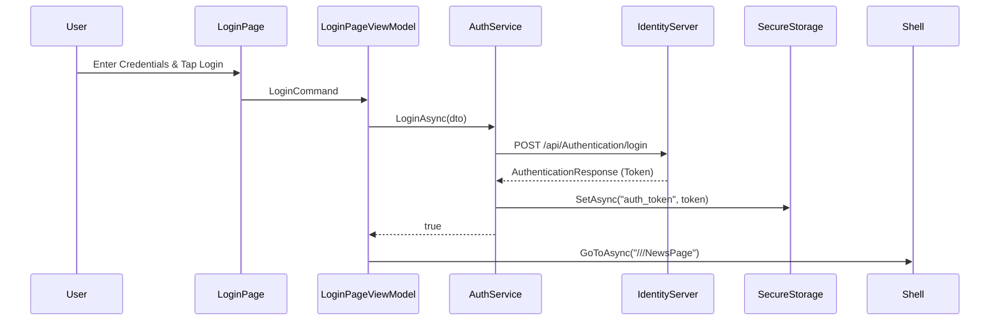
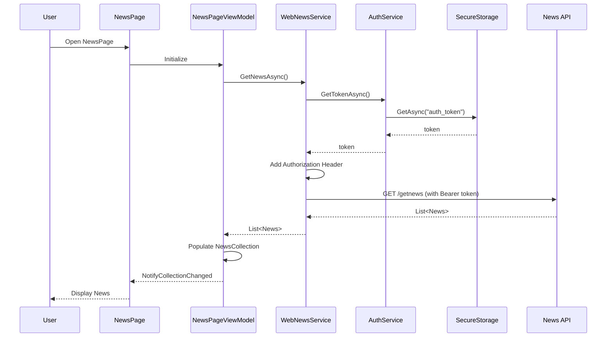

# Project Architecture - Innowise.Music

## Overview
Innowise.Music is a cross-platform audio streaming application built with .NET 9 MAUI. The application follows the MVVM pattern and targets iOS, Android, macOS, and Windows platforms.

## Technology Stack
- **Framework**: .NET 9 MAUI, CommunityToolkit.Maui
- **Backend Architecture**: ASP.NET Core Identity Server, Docker Compose
- **Architecture**: MVVM with CommunityToolkit.Mvvm
- **Database**: PostgreSQL
- **Logging**: Seq
- **Dependency Injection**: Microsoft.Extensions.DependencyInjection
- **Navigation**: Shell-based navigation

## Project Structure

```
Innowise.Music/ (Root)
├── Innowise.Music.sln        # Main solution file
├── docker-compose.yml        # Docker orchestration
├── Innowise.Music/           # MAUI Client Application
│   ├── Model/                # Data models
│   ├── View/                 # XAML pages
│   ├── ViewModel/            # ViewModels
│   ├── Services/             # Business logic
│   ├── Resources/            # Fonts, images, styles
│   ├── App.xaml              # Application resources
│   ├── AppShell.xaml.cs      # Shell navigation
│   ├── MauiProgram.cs        # DI configuration
│   └── Innowise.Music.csproj # Project file
├── Innowise.MusicIdentityServer/ # Backend Identity Server
│   ├── Controllers/          # API Controllers
│   ├── Data/                 # DB Context and Entities
│   ├── Models/               # DTOs
│   ├── Migrations/           # EF Core Migrations
│   ├── Program.cs            # Server entry point
│   └── Innowise.MusicIdentityServer.csproj
└── Docs/                     # Project documentation
    ├── changelog.md
    ├── project.md
    └── tasktracker.md
```

## Component Architecture

### Input Validation Architecture
The application incorporates a robust input validation system, adhering to the following principles:

- **`ValidatableObject<T>`**: ViewModels utilize `ValidatableObject<T>` for properties requiring validation. This class manages the value, validation status (`IsValid`), and a collection of error messages (`Errors`).
- **`IValidationRule<T>`**: Validation logic is encapsulated in classes implementing the `IValidationRule<T>` interface. This promotes reusability and separation of concerns.
- **Custom Rules**: Specific validation requirements are met through custom implementations of `IValidationRule<T>`, such as:
    - `EmailRule<string>`: Validates email address format.
    - `IsNotNullOrEmptyRule<string>`: Ensures a string value is not null, empty, or whitespace.
    - `CompareRule<T>`: Compares a value against a dynamically provided reference, used for password confirmation.
- **Error Display**: Validation feedback is presented to the user through:
    - **`InputEntryControl`**: A custom control that visually indicates validation status (e.g., changing border color for invalid input) and displays the first error message using an internal `Label`.
    - **`FirstValidationErrorConverter`**: A converter that extracts the first error from a collection of error messages for display.
- **Automatic Validation**: Validation is triggered automatically as the user types, providing immediate feedback. This is achieved using the `CommunityToolkit.Maui` library:
    - **`EventToCommandBehavior`**: Used within `InputEntryControl.xaml` to bind the `TextChanged` event of the underlying `Entry` to a validation command in the ViewModel.
    - **Validation Commands**: ViewModels expose `[RelayCommand]` methods (e.g., `ValidateEmailCommand`) that call the `.Validate()` method on the corresponding `ValidatableObject<T>`.

This architecture ensures a consistent and user-friendly validation experience across the application.

### Dependency Injection Graph


```mermaid
graph TD
    A[MauiProgram.cs] --> B[HttpHelper]
    A --> C[WebNewsService]
    A --> D[MockNewsService]
    A --> E[LoginPageViewModel]
    A --> F[SignUpPageViewModel]
    A --> G[NewsPageViewModel]
    A --> H[NewsDetailedPageViewModel]
    A --> I[LoginPage]
    A --> J[SignUpPage]
    A --> K[NewsPage]
    A --> L[NewsDetailedPage]
    A --> M[AuthService]
    
    C --> B
    C --> M
    G --> C
    E --> M
    F --> M
```

### Navigation Flow

```mermaid
graph LR
    A[AppShell] -->|RegisterRoute| B[SignUpPage]
    C[LoginPage] -->|SignUpCommand| B
    B -->|LoginCommand| D[//LoginPage]
    E[NewsPage] -->|GoToDetailsCommand| F[NewsDetailedPage]
    F -->|QueryProperty| G[NewsDetailedPageViewModel]
    H[App] -->|CheckAuth| C
    H -->|CheckAuth| E
```

### MVVM Communication


```mermaid
graph TD
    subgraph View Layer
        A[LoginPage]
        B[SignUpPage]
        C[NewsPage]
        D[NewsDetailedPage]
    end
    
    subgraph ViewModel Layer
        E[LoginPageViewModel]
        F[SignUpPageViewModel]
        G[NewsPageViewModel]
        H[NewsDetailedPageViewModel]
    end
    
    subgraph Service Layer
        I[WebNewsService]
        J[MockNewsService]
        K[HttpHelper]
        L[AuthService]
    end
    
    A -->|BindingContext| E
    B -->|BindingContext| F
    C -->|BindingContext| G
    D -->|BindingContext| H
    
    G -->|Inject| I
    I -->|Uses| K
    I -->|Uses| L
    E -->|Inject| L
    F -->|Inject| L
```

## Core Components

### 1. Authentication Module
**Files**: `LoginPage.xaml`, `SignUpPage.xaml`, `LoginPageViewModel.cs`, `SignUpPageViewModel.cs`, `IAuthService.cs`, `AuthService.cs`, `LoginUserDto.cs`, `UserDto.cs`, `AuthenticationResponse.cs`

**Responsibilities**:
- User authentication UI
- Navigation between login/signup flows
- JWT-based authentication using `SecureStorage`
- Interaction with `Innowise.MusicIdentityServer`

**Dependencies**: `IAuthService`, `SecureStorage`, `System.IdentityModel.Tokens.Jwt`

### 2. News Module
**Files**: `NewsPage.xaml`, `NewsDetailedPage.xaml`, `NewsPageViewModel.cs`, `NewsDetailedPageViewModel.cs`, `News.cs`

**Responsibilities**:
- Display news feed
- Show news details
- API integration for news retrieval with Bearer token support

**Dependencies**: `WebNewsService`, `HttpHelper`, `IAuthService`

### 3. Music Streaming Module (Phase 1)
**Files**: `Artist.cs`, `Album.cs`, `Track.cs`, `Genre.cs`, `IMusicService.cs`, `MusicService.cs`, `MusicController.cs`

**Responsibilities**:
- Music catalog management (Artists, Albums, Tracks, Genres)
- Full-text search across tracks, artists, and albums
- Audio streaming with range request support
- Play count tracking and popularity metrics

**Dependencies**: `DbContext`, `PostgreSQL`, `Entity Framework Core`

**API Endpoints**:
| Method | Endpoint | Description |
|--------|----------|-------------|
| GET | `/api/music/tracks?query={q}` | Search tracks with pagination |
| GET | `/api/music/tracks/{id}` | Get track details with metadata |
| GET | `/api/music/tracks/{id}/stream` | Stream audio with range support |
| GET | `/api/music/artists/{id}/top-tracks` | Get artist's popular tracks |
| GET | `/api/music/albums/{id}/tracks` | Get album track listing |

### 4. Services Layer
**Files**: `INewsService.cs`, `WebNewsService.cs`, `MockNewsService.cs`, `IHttpHelper.cs`, `HttpClientHelper.cs`, `IAuthService.cs`, `AuthService.cs`, `IMusicService.cs`, `MusicService.cs`

**Responsibilities**:
- HTTP client configuration
- News API communication
- Mock data for development
- User authentication and token management
- Music catalog data access and streaming

**Dependencies**: `HttpClient`, `SecureStorage`, `DbContext`

## Data Flow

### Authentication Flow (Login)


```mermaid
sequenceDiagram
    participant U as User
    participant LP as LoginPage
    participant LVM as LoginPageViewModel
    participant AS as AuthService
    participant API as IdentityServer
    participant SS as SecureStorage
    
    U->>LP: Enter Credentials & Tap Login
    LP->>LVM: LoginCommand
    LVM->>AS: LoginAsync(dto)
    AS->>API: POST /api/Authentication/login
    API-->>AS: AuthenticationResponse (Token)
    AS->>SS: SetAsync("auth_token", token)
    AS-->>LVM: true
    LVM->>Shell: GoToAsync("///NewsPage")
```

### News Retrieval Flow (Authenticated)


```mermaid
sequenceDiagram
    participant U as User
    participant NP as NewsPage
    participant NVM as NewsPageViewModel
    participant WNS as WebNewsService
    participant AS as AuthService
    participant SS as SecureStorage
    participant API as News API
    
    U->>NP: Open NewsPage
    NP->>NVM: Initialize
    NVM->>WNS: GetNewsAsync()
    WNS->>AS: GetTokenAsync()
    AS->>SS: GetAsync("auth_token")
    SS-->>AS: token
    AS-->>WNS: token
    WNS->>WNS: Add Authorization Header
    WNS->>API: GET /getnews (with Bearer token)
    API-->>WNS: List<News>
    WNS-->>NVM: List<News>
    NVM->>NVM: Populate NewsCollection
    NVM-->>NP: NotifyCollectionChanged
    NP-->>U: Display News
```

## Key Design Decisions

### 5. JWT Authentication with SecureStorage
- **Why**: Standard for securing mobile applications
- **Benefits**: Persistence across sessions, secure storage of sensitive tokens, automatic inclusion in API requests.

### 6. Startup Auth Check
- **Why**: Seamless user experience
- **Benefits**: Automatically redirects authenticated users to the main content, reducing friction.

## Current Status

### Completed
- ✅ Project infrastructure
- ✅ Authentication UI (Login/SignUp)
- ✅ News listing and details
- ✅ API integration layer
- ✅ MVVM architecture
- ✅ JWT Authentication Implementation
- ✅ Secure Token Storage
- ✅ Authenticated API Requests
- ✅ Music database schema (Artists, Albums, Tracks, Genres)
- ✅ Full-text search with PostgreSQL pg_trgm
- ✅ Music streaming API (5 essential endpoints)
- ✅ Audio streaming with range request support
- ✅ Music service layer with EF Core

## API Endpoints

### Identity & News Service (Unified)
| Method | Endpoint | Description |
|--------|----------|-------------|
| POST | `/api/Authentication/login` | User login |
| POST | `/api/Authentication/register` | User registration |
| GET | `/getnews` | Retrieve all news items |

### Music Streaming Service
| Method | Endpoint | Description |
|--------|----------|-------------|
| GET | `/api/music/tracks?query={q}` | Search tracks with pagination |
| GET | `/api/music/tracks/{id}` | Get track details with metadata |
| GET | `/api/music/tracks/{id}/stream` | Stream audio with range support |
| GET | `/api/music/artists/{id}/top-tracks` | Get artist's popular tracks |
| GET | `/api/music/albums/{id}/tracks` | Get album track listing |

**Base URL (HTTPS)**:
- Android Emulator: `https://10.0.2.2:7008`
- Desktop/iOS Simulator: `https://localhost:7008`

## Coding Standards

Refer to `QWEN.md` for detailed coding standards. Key points:
- PascalCase for classes, methods, public members
- camelCase with underscore prefix for private fields
- Interface names prefixed with "I"
- MVVM with `[ObservableObject]` and `[RelayCommand]`
- Async/await for I/O operations
- DI for all dependencies

## Testing Strategy

### Unit Tests (Planned)
- ViewModel command execution
- Service methods
- Model validation

### Integration Tests (Planned)
- API endpoints
- Navigation flows
- Database operations

## Security Considerations

### Current
- HTTPS for all API calls
- SSL bypass for localhost development (HttpHelper)
- **Secrets Management**: Docker Compose secrets (database passwords, Kestrel certificates) are managed via a local `.env` file, which is strictly excluded from source control.

### Planned
- JWT authentication
- Secure token storage
- OAuth 2.0 for Google SSO
- Encrypted local storage
