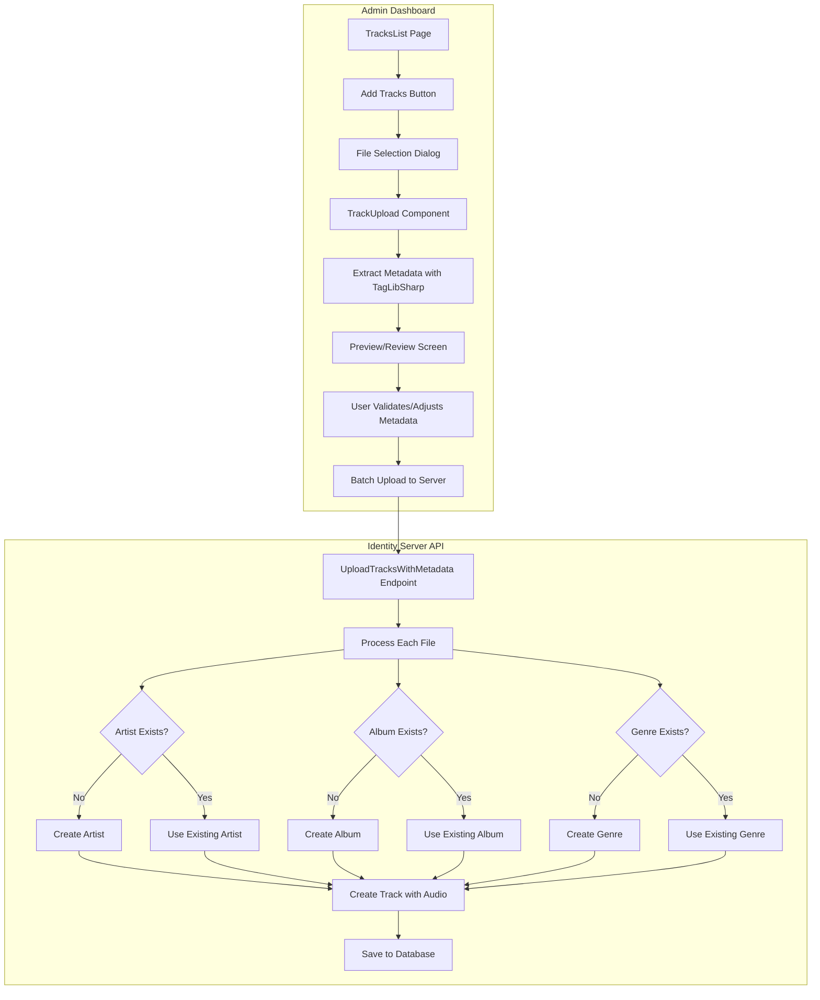

# Music Tracks Upload Implementation Plan

## Overview

This document outlines the implementation plan for adding music file upload functionality to the Innowise.Music Admin Dashboard. The feature will allow administrators to upload multiple audio files at once, automatically extract metadata using TagLibSharp, and create/update the corresponding entities (artists, albums, genres, tracks) in the identity server database.

## Architecture Diagram



## Models Alignment

### TagLibSharp Metadata vs Track Model

| TagLibSharp Property | Track Model Property | Type |
|---------------------|---------------------|------|
| `file.Tag.Title` | `Track.Title` | `string` |
| `file.Tag.Performers` | `Track.Artist` | `string[]` → `Artist` |
| `file.Tag.Album` | `Track.Album` | `string` → `Album` |
| `file.Tag.Genres` | `Track.Genres` | `string[]` → `ICollection<Genre>` |
| `file.Tag.Year` | `Album.ReleaseDate` | `uint` → `DateOnly?` |
| `file.Tag.Track` | `Track.TrackNumber` | `uint` → `int?` |
| `file.Properties.Duration` | `Track.Duration` | `TimeSpan` → `int` (seconds) |
| `file.Properties.AudioBitrate` | `Track.Bitrate` | `int` |
| `file.Properties.AudioSampleRate` | `Track.SampleRate` | `int` |
| `file.Properties.AudioChannels` | - | `int` (not stored) |
| File size | `Track.FileSize` | `long` |
| File extension | `Track.AudioFormat` | `string` |

### Existing Models Review

The models in both projects are well-aligned:

**Identity Server Models:**
- [`Track`](../Innowise.MusicIdentityServer/Models/Music/Track.cs) - Has all required properties including audio storage
- [`Artist`](../Innowise.MusicIdentityServer/Models/Music/Artist.cs) - Name, Biography, ImageUrl
- [`Album`](../Innowise.MusicIdentityServer/Models/Music/Album.cs) - Title, ArtistId, ReleaseDate, Genre
- [`Genre`](../Innowise.MusicIdentityServer/Models/Music/Genre.cs) - Name, Description, Color

**Admin Dashboard Models:**
- [`Track`](../Innowise.Music.Admin/Models/Track.cs) - Matches server model
- [`Artist`](../Innowise.Music.Admin/Models/Artist.cs) - Matches server model
- [`Album`](../Innowise.Music.Admin/Models/Album.cs) - Matches server model
- [`Genre`](../Innowise.Music.Admin/Models/Genre.cs) - Matches server model

## Implementation Tasks

### Phase 1: Backend API Development (Identity Server)

#### Task 1.1: Create Upload DTO
Create a new DTO for batch track upload with metadata:

```csharp
// Innowise.MusicIdentityServer/Models/Music/TrackUploadDto.cs
public class TrackUploadDto
{
    public string FileName { get; set; }
    public byte[] AudioData { get; set; }
    public string Title { get; set; }
    public string ArtistName { get; set; }
    public string? AlbumName { get; set; }
    public string[]? Genres { get; set; }
    public int Duration { get; set; }
    public int? TrackNumber { get; set; }
    public int? Bitrate { get; set; }
    public int? SampleRate { get; set; }
    public long FileSize { get; set; }
    public string AudioFormat { get; set; }
    public uint? Year { get; set; }
}
```

#### Task 1.2: Add Service Method for Batch Upload
Add method to [`IMusicService`](../Innowise.MusicIdentityServer/Services/IMusicService.cs) and [`MusicService`](../Innowise.MusicIdentityServer/Services/MusicService.cs):

```csharp
Task<BatchUploadResult> UploadTracksAsync(IEnumerable<TrackUploadDto> tracks);
Task<Artist?> GetOrCreateArtistAsync(string artistName);
Task<Album?> GetOrCreateAlbumAsync(string albumTitle, Guid artistId, uint? year);
Task<IEnumerable<Genre>> GetOrCreateGenresAsync(IEnumerable<string> genreNames);
```

#### Task 1.3: Add Controller Endpoint
Add new endpoint to [`AdminMusicController`](../Innowise.MusicIdentityServer/Controllers/AdminMusicController.cs):

```csharp
[HttpPost("tracks/upload-batch")]
[RequestSizeLimit(500 * 1024 * 1024)] // 500MB for batch
public async Task<IActionResult> UploadTracksBatch(IList<IFormFile> files)
```

### Phase 2: Admin Dashboard Development

#### Task 2.1: Add Upload Method to Service
Extend [`IAdminMusicService`](../Innowise.Music.Admin/Services/IAdminMusicService.cs) and [`AdminMusicService`](../Innowise.Music.Admin/Services/AdminMusicService.cs):

```csharp
Task<BatchUploadResult> UploadTracksBatchAsync(IEnumerable<TrackUploadDto> tracks);
```

#### Task 2.2: Create MultiTrackUpload Component
Create new Blazor component for multi-file upload:

**File:** `Innowise.Music.Admin/Components/Pages/Tracks/MultiTrackUpload.razor`

Features:
- File selection with drag-and-drop support
- File type validation (mp3, aac, flac, wav only)
- File size validation (50MB per file, 500MB total)
- Progress indicator during metadata extraction
- Preview table showing extracted metadata
- Dropdown selectors for existing artists/albums/genres
- Options to create new entities if not found
- Batch upload with progress bar

#### Task 2.3: Update TracksList Page
Modify [`TracksList.razor`](../Innowise.Music.Admin/Components/Pages/Tracks/TracksList.razor) to add "Add Tracks" button:

```razor
<div class="page-header">
    <h1>Tracks Management</h1>
    <a href="/tracks/new" class="btn-primary">+ Add Track</a>
    <a href="/tracks/upload-multi" class="btn-secondary">Add Tracks</a>
</div>
```

#### Task 2.4: Create Upload Models
Add models for the upload process:

**File:** `Innowise.Music.Admin/Models/TrackUploadDto.cs`
**File:** `Innowise.Music.Admin/Models/ExtractedTrackMetadata.cs`

### Phase 3: Metadata Extraction Service

#### Task 3.1: Create Metadata Extractor Service
Create a service to extract metadata using TagLibSharp:

**File:** `Innowise.Music.Admin/Services/IMetadataExtractionService.cs`
**File:** `Innowise.Music.Admin/Services/MetadataExtractionService.cs`

```csharp
public interface IMetadataExtractionService
{
    Task<ExtractedTrackMetadata> ExtractMetadataAsync(Stream fileStream, string fileName);
    Task<IEnumerable<ExtractedTrackMetadata>> ExtractMetadataBatchAsync(
        IEnumerable<(Stream Stream, string FileName)> files);
}
```

## File Structure

```
Innowise.Music.Admin/
├── Components/
│   └── Pages/
│       └── Tracks/
│           ├── MultiTrackUpload.razor      # NEW: Multi-file upload UI
│           ├── MultiTrackUpload.razor.cs   # NEW: Code-behind
│           ├── TracksList.razor            # MODIFY: Add button
│           └── TrackUpload.razor           # EXISTING: Single file upload
├── Models/
│   ├── TrackUploadDto.cs                   # NEW: Upload DTO
│   └── ExtractedTrackMetadata.cs           # NEW: Extracted metadata model
└── Services/
    ├── IMetadataExtractionService.cs       # NEW: Metadata extraction interface
    ├── MetadataExtractionService.cs        # NEW: Metadata extraction implementation
    ├── IAdminMusicService.cs               # MODIFY: Add batch upload method
    └── AdminMusicService.cs                # MODIFY: Implement batch upload

Innowise.MusicIdentityServer/
├── Models/
│   └── Music/
│       └── TrackUploadDto.cs               # NEW: Upload DTO for API
├── Services/
│   ├── IMusicService.cs                    # MODIFY: Add batch methods
│   └── MusicService.cs                     # MODIFY: Implement batch methods
└── Controllers/
    └── AdminMusicController.cs             # MODIFY: Add batch upload endpoint
```

## Detailed Workflow

### Step 1: File Selection
1. User clicks "Add Tracks" button in TracksList
2. File dialog opens allowing multiple file selection
3. Only .mp3, .aac, .flac, .wav files are accepted
4. Maximum 10 files per batch, 50MB per file

### Step 2: Metadata Extraction
1. For each selected file:
   - Use TagLibSharp to extract metadata
   - Read file properties (duration, bitrate, sample rate)
   - Store binary data in memory
2. Display loading indicator during extraction

### Step 3: Preview and Validation
1. Show table with extracted metadata for each track:
   - Title, Artist, Album, Genres, Duration, Track Number
2. For each entity type (Artist, Album, Genre):
   - Show dropdown with existing options
   - Auto-select if exact match found
   - Allow creating new if not found
3. Allow manual editing of any field

### Step 4: Batch Upload
1. User clicks "Upload All" button
2. Send all tracks with metadata and audio data to server
3. Server processes each track:
   - Get or create Artist
   - Get or create Album (with Artist and Year)
   - Get or create Genres
   - Create Track with all relationships
   - Store audio binary data
4. Show progress and results

### Step 5: Completion
1. Display summary of uploaded tracks
2. Show any errors for failed uploads
3. Option to upload more or return to tracks list

## API Endpoints

### New Endpoint: Batch Upload Tracks

```
POST /api/admin/tracks/upload-batch
Content-Type: multipart/form-data

Request:
- files: IList<IFormFile> (multiple audio files)

Response:
{
  "success": true,
  "uploadedCount": 5,
  "failedCount": 0,
  "results": [
    {
      "fileName": "song1.mp3",
      "trackId": "guid",
      "success": true
    }
  ],
  "errors": []
}
```

## Validation Rules

### File Validation
- Allowed extensions: `.mp3`, `.aac`, `.flac`, `.wav`
- Max file size: 50MB per file
- Max batch size: 30 files
- Max total size: 500MB

### Metadata Validation
- Title: Required, max 255 characters
- Artist: Required, will be created if not exists
- Duration: Required, must be > 0
- Album: Optional
- Genres: Optional

## Error Handling

### Client-Side Errors
- Invalid file type
- File too large
- Metadata extraction failure
- Network errors

### Server-Side Errors
- Database constraint violations
- File storage errors
- Concurrent modification conflicts

## Testing Strategy

### Unit Tests
1. MetadataExtractionService tests
   - Test extraction from various file formats
   - Test handling of missing metadata
   - Test file validation

2. MusicService tests
   - Test GetOrCreateArtist logic
   - Test GetOrCreateAlbum logic
   - Test batch upload transaction handling

### Integration Tests
1. End-to-end upload flow
2. API endpoint testing
3. Database state verification after upload

## Security Considerations

1. **File Type Validation**: Validate file signatures, not just extensions
2. **Size Limits**: Enforce server-side size limits
3. **Authentication**: Require Administrator role
4. **Input Sanitization**: Sanitize all metadata fields
5. **SQL Injection**: Use parameterized queries via EF Core

## Performance Considerations

1. **Memory Usage**: Stream files instead of loading entirely into memory
2. **Database**: Use bulk operations where possible
3. **Timeouts**: Set appropriate timeout for large file uploads
4. **Progress Reporting**: Use SignalR for real-time progress updates (optional)

## Future Enhancements

1. **Album Art Extraction**: Extract and store album cover images
2. **Duplicate Detection**: Check for existing tracks before upload
3. **Audio Processing**: Normalize audio levels, convert formats
4. **Progressive Upload**: Chunk large files for resumable uploads
5. **Background Processing**: Use Hangfire for async processing

## Dependencies

- **TagLibSharp**: Already added to Admin project for metadata extraction
- **Entity Framework Core**: For database operations
- **ASP.NET Core**: For API endpoints

## Checklist

- [ ] Create TrackUploadDto models in both projects
- [ ] Implement MetadataExtractionService
- [ ] Add batch upload endpoint to AdminMusicController
- [ ] Implement batch upload logic in MusicService
- [ ] Create MultiTrackUpload Blazor component
- [ ] Update IAdminMusicService and AdminMusicService
- [ ] Modify TracksList.razor to add "Add Tracks" button
- [ ] Add file type and size validation
- [ ] Implement preview/validation UI
- [ ] Add error handling and user feedback
- [ ] Write unit tests
- [ ] Test end-to-end upload flow
- [ ] Update documentation

## Timeline Estimate

| Phase | Tasks | Estimated Time |
|-------|-------|----------------|
| Phase 1 | Backend API | 4-6 hours |
| Phase 2 | Admin Dashboard | 6-8 hours |
| Phase 3 | Metadata Service | 2-3 hours |
| Testing | Unit & Integration | 3-4 hours |
| **Total** | | **15-21 hours** |

---

*Document created: 2026-04-01*
*Last updated: 2026-04-01*